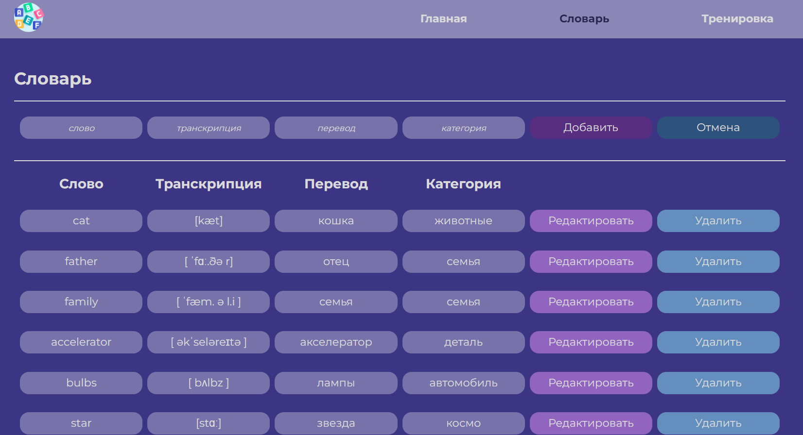
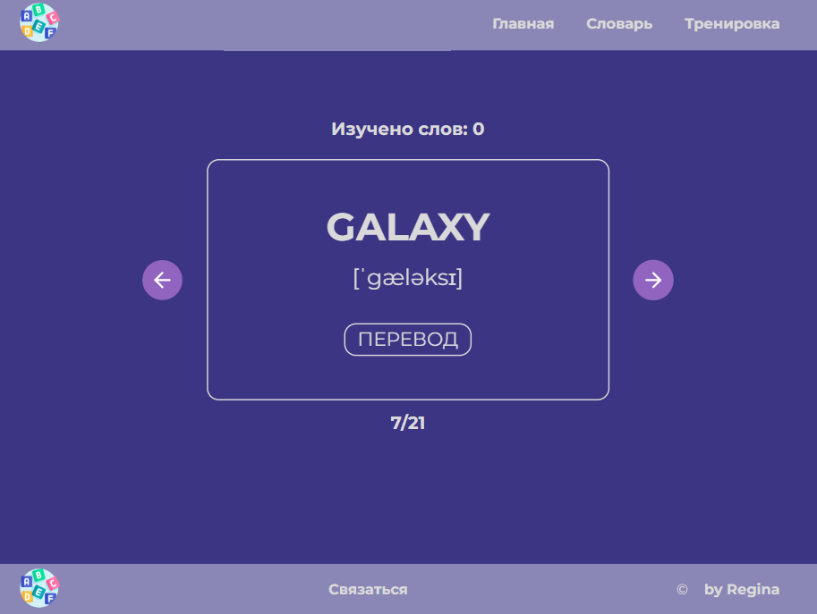

<!-- PROJECT LOGO -->
<br />
<div align="center">
  <a href="https://github.com/Regina5425/wordbook-app">
    
  </a>

  <h1 align="center">WordBook</h1>

  <p align="center">
    Application for memorizing foreign words
  </p>
</div>


<!-- ABOUT THE PROJECT -->
## About The Project

<div align="center">
  <span>
    
   </span>
   <span>
    
   </span>
</div>

The application consists of the main page, a dictionary, and a training page of the studied words.

Features: 
* A random word is displayed on the main page;
* On the dictionary page each word has a basic meaning, transcription, translation, and theme;
* You can add new words, edit, and delete words;
* On the training page you can practice previously studied words, their records are kept;
* implemented adaptive and responsive design


### Built With

<p>
  
  
  
  
  
  
</p>


<!-- GETTING STARTED -->
### Installation

1. Clone the repo
   ```sh
   git clone https://github.com/Regina5425/wordbook-app.git
   ```
2. Install NPM packages
   ```sh
   npm install
   ```
3. Run the app on your localhost
   ```js
   npm start
   ```

<!-- CONTACT -->
## Contact

Regina - reina5425@gmail.com

Project Link: [https://github.com/Regina5425/wordbook-app](https://github.com/Regina5425/wordbook-app)
